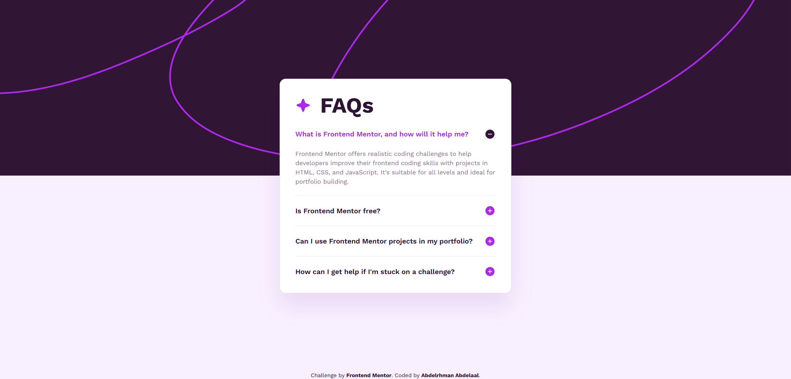

# Frontend Mentor - Fylo Dark Theme Landing Page solution

This is a solution to the [Fylo Dark Theme Landing Page challenge on Frontend Mentor](https://www.frontendmentor.io/challenges/fylo-dark-theme-landing-page-5ca5f2d21e82137ec91a50fd). Frontend Mentor challenges help you improve your coding skills by building realistic projects.

## Table of contents

- [Overview](#overview)
  - [Screenshot](#screenshot)
  - [Links](#links)
- [My process](#my-process)
  - [Built with](#built-with)
  - [What I learned](#what-i-learned)
- [Author](#author)

## Overview

### Screenshot



### Links

- Solution URL: [GitHub](https://github.com/MrBlackvanta/fylo-dark-theme-landing-page)
- Live Site URL: [Netlify](https://vanta-fylo-dark-theme-landing-page.netlify.app)

## My process

### Built with

- [Next.js 16](https://nextjs.org/) (App Router, React Compiler, Turbopack)
- [React 19](https://react.dev/)
- TypeScript
- [Tailwind CSS v4](https://tailwindcss.com/) (theme via `@theme`, type presets via `@utility`)
- `next/font` for Work Sans (`display: swap`)
- Native `<details>` / `<summary>` for the accordion — no JavaScript
- Semantic HTML5 landmarks (`<main>`, `<section>`, `<footer>`) with a real `<ul>` for the question list
- Mobile-first responsive layout, a single `sm:` breakpoint
- Fully static output — pre-rendered at build time

### What I learned

**`<details>` / `<summary>` is the accessible default for disclosure widgets.** No state, no JS, no `aria-expanded` to manage — the browser handles keyboard, focus, and screen-reader announcements for free. The work is mostly styling: hide the default marker (`marker:content-none`), wrap the question in a real `<h2>` inside `<summary>` so heading navigation still works, and mark the +/- icons `aria-hidden` because the expanded/collapsed state is already exposed by the element itself.

**Animating `height: auto` is now actually possible — but requires opting in.** Two pieces have to line up: `interpolate-size: allow-keywords` on `:root` (or `html`) tells the browser it's allowed to interpolate intrinsic size keywords like `auto`, and the transition has to target the `::details-content` pseudo-element rather than `<details>` itself:

```css
html { interpolate-size: allow-keywords; }

details::details-content {
  transition:
    height 0.5s ease,
    content-visibility 0.5s allow-discrete;
}
```

Without `interpolate-size`, `height: auto` snaps. Without `allow-discrete` on `content-visibility`, the content disappears instantly at the start of the close instead of fading with the height.

**`overflow: hidden` clips your focus ring.** I put `overflow-hidden` on the `<details>` to keep the animated content from leaking. That also clipped the focus outline on `<summary>` — only the bottom edge was visible because the summary sits flush at the top of its parent. The fix isn't to redesign the focus state; it's to scope the clipping to the element that actually needs clipping. Move `overflow: hidden` onto `::details-content` (the part that's animating), and the summary's outline can render freely:

```css
/* on <details>: nothing */
/* on the pseudo-element only: */
[&::details-content]:overflow-hidden
```

Lesson: `overflow: hidden` clips _everything_ inside, including outlines that would extend past child borders. Apply it as locally as the design allows.

**`viewport` is its own export in Next 14+.** I started with `themeColor` and viewport fields inside `metadata` and got a build warning pointing at `generate-viewport`. The fix is a separate `export const viewport: Viewport = { ... }` alongside `metadata`. Also: don't set `maximumScale: 1` or `userScalable: false` — they're shortcuts to losing accessibility points, because users who need to zoom can't.

**Hydration mismatches aren't always your code.** First time I hit React's "tree hydrated but some attributes... didn't match" warning, the diff showed `data-atm-ext-installed="1.30.01"` on `<body>` — injected by a browser extension between the server response arriving and React hydrating. Verified in incognito (warning gone), confirmed it wasn't a code bug. The escape hatch when extensions stamp `<html>` or `<body>` is `suppressHydrationWarning` on that single element — but only after confirming the cause, never as a reflexive silencer.

**Tailwind v4 type presets via `@utility`, with size tokens in `@theme`.** Lifting the brand display sizes into theme tokens (`--text-display-sm`, `--text-display-lg`) keeps `@utility display` free of magic values:

```css
@theme {
  --text-display-sm: 2rem;
  --text-display-lg: 3.5rem;
}

@utility display {
  @apply text-display-sm sm:text-display-lg leading-none font-bold;
}
```

Custom font-size tokens become first-class Tailwind utilities (`text-display-sm`), which means responsive variants compose correctly — something `@layer components` historically didn't do well.

## Author

- UpWork - [Abdelrhman Abdelaal](https://upwork.com/freelancers/~01f0a9479696b61f49)
- Frontend Mentor - [@MrBlackvanta](https://www.frontendmentor.io/profile/MrBlackvanta)
- LinkedIn - [Abdelrhman Abdelaal](https://www.linkedin.com/in/abdelrhman-vanta/)
