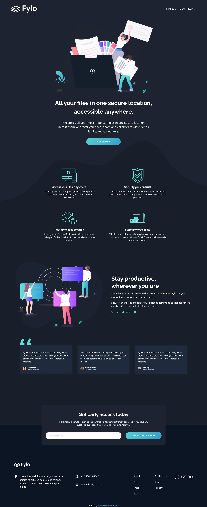

# Fylo dark theme landing page

My solution to the [Fylo dark theme landing page](https://www.frontendmentor.io/challenges/fylo-dark-theme-landing-page-5ca5f2d21e82137ec91a50fd)
challenge on Frontend Mentor.

- Live: https://fylo-dark-theme-landing-page.abdelrhman-ahmed8881.workers.dev
- Code: https://github.com/MrBlackvanta/fylo-dark-theme-landing-page

## Built with

- Next.js 16
- React 19 and TypeScript
- Tailwind CSS v4
- React Hook Form

## Notes

A few things I got wrong first and fixed:

**`priority` isn't the same as `fetchPriority="high"` plus `loading="eager"`.** I set
both by hand on the hero and thought that covered it. It doesn't. `priority` also
injects a `<link rel="preload">` into the head, which is the part that actually helps,
because the browser starts the request before it finishes parsing the body. One image
per page, and only if it's the LCP.

**Static image imports already carry their dimensions.** I'd typed width and height into
the data layer next to each import and passed them as props. `import img from "..."`
returns an object that already has them, so `<Image>` infers them from `src`. Two
sources of truth for no reason.

**Tailwind ignores typo'd variants silently.** I had `mx:px-0` and `mb:mb-2` where I
meant `md:`. No error, no rule emitted, class string looks fine in the source. Now when
a responsive tweak doesn't take, I check the compiled CSS instead of re-reading the JSX.

**`<blockquote>` is the quote.** I had the quote in a `
` next to a `<blockquote>`
holding the avatar and name. Backwards. The quoted text goes inside, attribution goes
inside it in a `<footer>`, and `<cite>` is for the title of a work, not a person, so the
name is a plain ``.

**An `<a>` without `href` isn't a link.** The footer address row has no href in the data,
so it rendered as a bare `<a>`: not focusable, not announced. Optional data needs
optional markup, so the row only becomes a link when there's something to link to.

**`aria-label` goes on the `<a>`, not the icon inside it.** I'd put it on the SVG and the
links still announced as "link". The accessible name comes from the link's content. The
SVG is `aria-hidden` now.

**`useId()` inside an SVG makes it a client component.** Several icons here use internal
ids for filters and clip paths, which collide if the icon renders twice. Routing them
through `useId` fixes that but `useId` is a hook, so every patched file becomes
`"use client"`. The alternative is a hardcoded per-file prefix, which stays a server
component but breaks if the icon is ever used twice on a page. I took the safe one here.

## Author

- [LinkedIn](https://www.linkedin.com/in/abdelrhman-vanta/)
- [UpWork](https://www.upwork.com/freelancers/mrblackvanta)
- [Frontend Mentor](https://www.frontendmentor.io/profile/MrBlackvanta)
